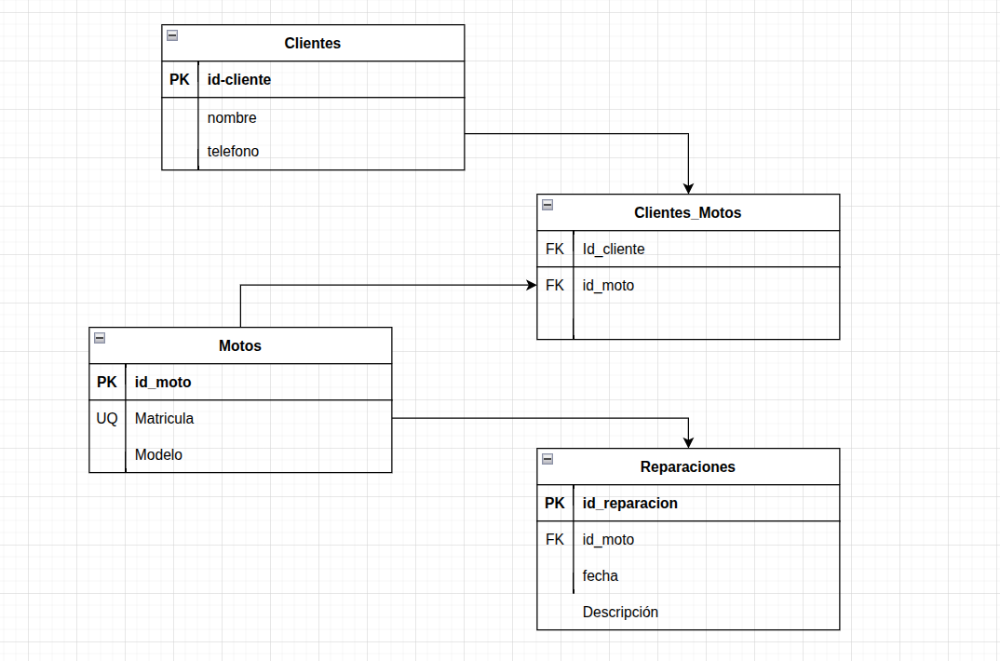

# Marco Tecnológico

## 1. Alcance del proyecto

### 1.1 Alcance funcional

El proyecto consiste en el diseño, implementación y configuración de una **infraestructura de servidor web** destinada a alojar una plataforma web informativa para un taller especializado en restauración y personalización de motocicletas. El objetivo principal es proporcionar una solución estable, segura y fácilmente recuperable ante fallos, priorizando la administración de sistemas frente al desarrollo de la aplicación.

Se incluye dentro del alcance del proyecto:
- Despliegue de una página web informativa mediante WordPress.
- Publicación de servicios ofrecidos y proyectos realizados.
- Implementación de una galería de imágenes.
- Inclusión de información de contacto y localización.
- Gestión básica de contenidos mediante el panel de administración de WordPress.
- Publicación de la documentación técnica del proyecto a través de GitHub Pages.
- Configuración de mecanismos de seguridad y copias de seguridad a nivel de servidor.
- Infraestructura preparada para futuras ampliaciones.

Quedan excluidos del alcance:
- Implementación de comercio electrónico o sistemas de venta online.
- Gestión avanzada de inventario, pedidos o facturación.
- Integración con sistemas ERP o pasarelas de pago.
- Desarrollo de funcionalidades avanzadas o personalizadas en WordPress.

---

### 1.2 Alcance técnico

El proyecto se basa en tecnologías de **código abierto**, alineadas con los contenidos del ciclo formativo de **Administración de Sistemas Informáticos en Red (ASIR)** y ampliamente utilizadas en entornos profesionales.

Las tecnologías y plataformas seleccionadas son:
- **Sistema operativo:** Ubuntu Server  
- **Plataforma de virtualización/contenedores:** Docker  
- **Servidor web:** Apache  
- **CMS:** WordPress  
- **Sistema gestor de bases de datos:** MySQL  
- **Control de versiones:** Git y GitHub  
- **Documentación técnica:** GitHub Pages  

#### Justificación de la plataforma de virtualización

Se ha seleccionado Docker como entorno de virtualización por los siguientes motivos:
- Permite el aislamiento de servicios mediante contenedores independientes.
- Facilita la instalación, mantenimiento y replicabilidad del entorno.
- Reduce el impacto de fallos en el sistema base.
- Optimiza el uso de recursos frente a máquinas virtuales tradicionales.
- Se ajusta al alcance académico del proyecto y a los objetivos del módulo ASIR.

---

### 1.3 Alcance temporal

El proyecto se desarrollará en las siguientes fases:

1. **Planificación y análisis**  
   Definición del contexto, objetivos y requisitos del sistema.  
   Entregable: documentación inicial del proyecto.

2. **Implementación del entorno de sistemas**  
   Instalación y configuración de Ubuntu Server, despliegue del entorno Docker y configuración de Apache, MySQL y WordPress.  
   Entregable: entorno servidor operativo.

3. **Seguridad, copias de seguridad y documentación**  
   Aplicación de medidas de seguridad, configuración de HTTPS, copias de seguridad y publicación de la documentación técnica.  
   Entregable: sistema validado y documentación final.

Los principales hitos del proyecto son:
- **Hito 1:** servidor configurado con servicios funcionales.
- **Hito 2:** sistema seguro, documentado y listo para entrega.

---

### 1.4 Alcance de recursos

#### Equipo y roles
- **Jesús:** Responsable de la instalación,administración y mantenimiento de tanto el Ubuntu server HOST, como de las redes y contenedores gestionados en docker.
- **Jose Carlos:** Responsable de la creación,mantenimiento y gestión de la base de datos adapatada a las necesidades pertinentes del taller.
- **Israel:** Responsable de el diseño de la página web y de el firewall personalizado del servidor .
- **Tutor del proyecto:** supervisión y validación de los entregables.

#### Presupuesto estimado

El proyecto se desarrolla utilizando software libre y servicios gratuitos, no obstante puede estar sujeto a pagos necesarios ( validación de certificados, dominio, Sobrecostes por IP PÚBLICA):
- Ubuntu Server, Docker, Apache, MySQL y WordPress.
- GitHub y GitHub Pages para control de versiones y documentación.

El coste económico del proyecto es **nulo**, limitándose al uso del equipo personal del alumno y conexión a internet.
El coste de un despliegue real simultaneo a el proyecto, si que conllevaria los costes adicionales mencionados anteriormente.

---

## 2. Diseño Conceptual

El diseño conceptual describe la **infraestructura y organización de servicios** del proyecto, mostrando cómo se interconectan los distintos elementos del sistema, cómo se gestiona la persistencia de datos y cómo se asegura la comunicación segura y el aislamiento entre servicios.

### 2.1 Infraestructura del sistema

El sistema se implementa sobre un **host Ubuntu Server**, que actúa como base para todos los servicios:

- **Ubuntu Server (host)**  
  - Sistema operativo base para la gestión de usuarios, permisos y servicios del servidor.  
  - Configuración de firewall mediante **nftables** para controlar el tráfico entrante y saliente del host y proteger los servicios desplegados.

  

- **Docker Engine**  
  - Motor de contenedores que permite ejecutar los servicios de forma aislada.  
  - Gestiona la creación de contenedores, redes internas y volúmenes persistentes.  
  - Garantiza portabilidad, escalabilidad y facilidad de mantenimiento del entorno.

- **Contenedores principales**
  - **Contenedor MySQL**
    - Base de datos relacional que almacena la información de WordPress (usuarios, contenidos, configuraciones).  
    - Utiliza un **volumen Docker persistente** para asegurar la disponibilidad y recuperación de datos.
    
  - **Contenedor WordPress + Apache**
    - Servidor web Apache que gestiona el CMS WordPress.  
    - Almacena archivos de WordPress y configuraciones en un **volumen Docker persistente**.  
    - Conectado a MySQL a través de la **red interna Docker** para comunicaciones seguras y aisladas.  
    - Configurado para acceso seguro mediante **HTTPS** con certificados Let’s Encrypt.

- **Red interna Docker**
  - Red privada que permite la comunicación entre contenedores sin exponer la base de datos directamente a la red externa.  
  - Garantiza aislamiento y seguridad de los servicios.

- **Volúmenes Docker**
  - Permiten la persistencia de datos importantes (MySQL y WordPress) frente a reinicios o recreaciones de contenedores.  
  - Facilitan la realización de copias de seguridad completas del entorno.

  

### 2.2 Flujo de datos

1. El usuario accede al sitio web mediante navegador web.  
2. La solicitud llega al contenedor **WordPress + Apache**, que procesa la petición y genera la respuesta.  
3. WordPress consulta o actualiza datos en el contenedor **MySQL** a través de la red interna Docker.  
4. Los datos son devueltos al contenedor de Apache y presentados al usuario mediante HTTPS.  
5. Los volúmenes Docker aseguran que toda la información crítica se almacene de forma persistente, permitiendo recuperación en caso de fallos.

### 2.3 Seguridad y aislamiento

- **Firewall nftables** en Ubuntu Server:
  - Controla y filtra el tráfico entrante y saliente del host.  
  - Permite únicamente conexiones autorizadas hacia Apache (HTTP/HTTPS) y SSH hacia el host.  

- **Red interna Docker**
  - Aísla el tráfico de los contenedores y evita accesos no autorizados a la base de datos.  

- **HTTPS con Let’s Encrypt**
  - Garantiza cifrado de extremo a extremo de las comunicaciones web.  
  - Configuración dentro del contenedor de Apache para forzar el uso de HTTPS.  

- **Volúmenes persistentes**
  - Protegen los datos frente a reinicios de contenedores o fallos del sistema.

### 2.4 Justificación del diseño

- Separación de servicios en contenedores para **aislamiento, seguridad y facilidad de mantenimiento**.  
- Uso de **volúmenes persistentes** para asegurar la recuperación de datos en caso de fallos.  
- **nftables** como firewall del host permite un control granular del tráfico de red y mejora la seguridad general.  
- La **red interna Docker** asegura que la comunicación entre WordPress y MySQL sea segura y privada.  
- Apache con HTTPS garantiza acceso seguro al CMS.  
- Este diseño conceptual es **reproducible, escalable y alineado con los objetivos de ASIR**, listo para la fase de implementación.

---

## 3. Requisitos del sistema

### 3.1 Requisitos funcionales (RF)

- **RF-001:** El sistema debe permitir la gestión de contenidos informativos mediante un CMS.
- **RF-002:** El sistema debe permitir la visualización estructurada de servicios y proyectos.
- **RF-003:** El sistema debe disponer de un panel básico de administración del contenido.

---

### 3.2 Requisitos no funcionales (RNF)

- **RNF-001:** El sistema debe garantizar un tiempo de carga adecuado para el acceso web.
- **RNF-002:** El sitio web debe ser accesible desde distintos dispositivos (diseño responsive).
- **RNF-003:** El sistema debe disponer de **copias de seguridad completas a nivel de servidor**, que permitan la recuperación ante fallos físicos o lógicos.
- **RNF-004:** El sistema debe garantizar comunicaciones seguras mediante el uso de **HTTPS**.

---

### 3.3 Requisitos de negocio (RN)

- **RN-001:** Mejorar la visibilidad online del taller y su presencia digital.

---

## 4. Especificación de requisitos por módulos

### 4.1 ASGBD – Administración de Sistemas Gestores de Bases de Datos
- Instalación y configuración del sistema gestor de bases de datos MySQL.
- Creación y gestión de la estructura de base de datos utilizada por WordPress.
- Configuración de usuarios y sus respectivos permisos.
- Inclusión de la base de datos en las copias de seguridad del servidor.

---

### 4.2 ASO – Administración de Sistemas Operativos
- Instalación y configuración de Ubuntu Server en entorno Docker.
- Gestión de usuarios, permisos y políticas básicas de seguridad.
- Configuración y control de servicios del sistema (Apache y MySQL).
- Implementación de copias de seguridad completas del entorno.
- Conexión entre WordPress y la base de datos MySQL.
- Aislamiento de servicios mediante redes Docker personalizadas.

---

### 4.3 IAW – Implantación de Aplicaciones Web
- Instalación y configuración del servidor web Apache.
- Instalación y configuración de WordPress.
- Administración de usuarios del CMS.
- Personalización básica de la aplicación web.

---

### 4.4 Servicios de Red e Internet
- Configuración de acceso remoto seguro mediante SSH.
- Configuración de DNS básico o uso de DNS externo.
- Publicación del servicio web mediante Apache.
- Implementación de certificados SSL mediante **Let’s Encrypt**.

---

### 4.5 Seguridad y Alta Disponibilidad
- Configuración de firewall básico mediante ufw o reglas de red Docker.
- Implementación de certificados SSL mediante **Let’s Encrypt**.
- Configuración de Apache para forzar el uso de HTTPS.
- Análisis básico de amenazas y aplicación de medidas de protección.
- Protección frente a pérdida de datos mediante copias de seguridad a nivel de servidor.

---

## 5. Matriz de trazabilidad de requisitos

La matriz de trazabilidad permite relacionar los requisitos definidos con los módulos del ciclo formativo de ASIR, asegurando la coherencia entre los objetivos del proyecto, los contenidos formativos y los entregables finales.
