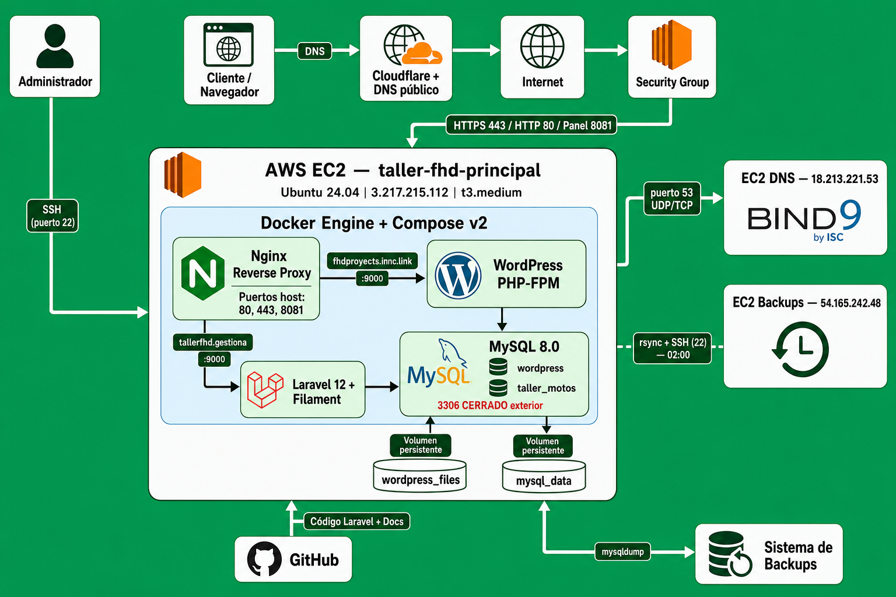
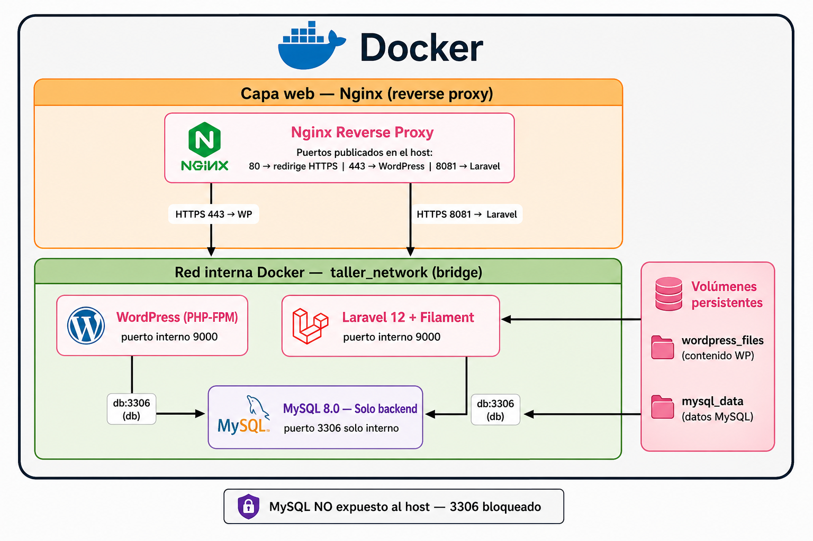
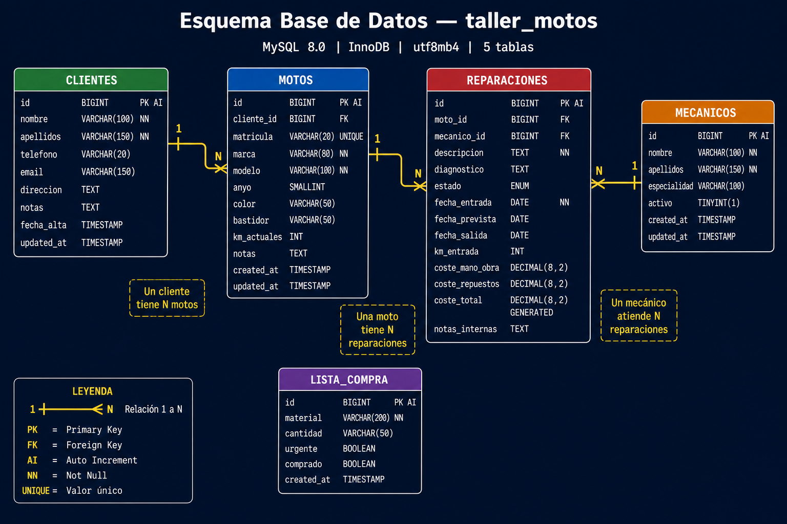

# Marco Tecnológico

## 1. Diseño Conceptual

El diseño conceptual describe la **infraestructura y organización de servicios** del proyecto, mostrando cómo se interconectan los distintos elementos del sistema, cómo se gestiona la persistencia de datos y cómo se asegura la comunicación segura y el aislamiento entre servicios.

---

### 1.1 Visión general de la infraestructura

El sistema se implementa sobre una instancia **AWS EC2 con Ubuntu Server 22.04**, que actúa como base para todos los servicios. Sobre ella corre **Docker Compose v2**, que orquesta cuatro contenedores interconectados a través de una red interna privada.



*Figura 1. Mapa conceptual que representa la infraestructura tecnológica del sistema, mostrando la relación entre AWS EC2, los contenedores Docker y las redes internas.*

---

### 1.2 Host y firewall perimetral

- **AWS EC2 (Ubuntu Server 22.04)**
  - Instancia cloud que actúa como servidor base de toda la infraestructura.
  - Proporciona IP pública fija mediante **Elastic IP** de AWS.
  - Gestión de usuarios, permisos del sistema de archivos y servicios Docker.

- **Security Groups de AWS**
  - Sustituyen al firewall tradicional del host en entornos cloud.
  - Controlan y filtran el tráfico entrante y saliente a nivel de instancia.
  - Configuración aplicada:

    | Puerto | Protocolo | Origen    | Uso                          |
    |--------|-----------|-----------|------------------------------|
    | 80     | TCP       | 0.0.0.0/0 | Web pública WordPress        |
    | 8081   | TCP       | 0.0.0.0/0 | Panel admin Laravel/Filament |
    | 22     | TCP       | IP propia | Acceso SSH administrador     |
    | 3306   | —         | CERRADO   | MySQL nunca expuesto         |

---

### 1.3 Plataforma Docker y diseño de contenedores

- **Docker Engine + Docker Compose v2**
  - Motor de contenedores que ejecuta los servicios de forma aislada.
  - Gestiona la creación de contenedores, redes internas y volúmenes persistentes.
  - Garantiza portabilidad, escalabilidad y facilidad de mantenimiento.
  - Se usa **Compose v2** como plugin nativo (comando `docker compose`, sin guión).

- **Red interna Docker (`taller_network`)**
  - Red privada de tipo `bridge` que conecta todos los contenedores.
  - Los contenedores se comunican entre sí por nombre (ej: `db:3306`).
  - La base de datos MySQL **nunca es accesible** desde el exterior.

- **Volúmenes Docker**
  - Permiten la persistencia de datos frente a reinicios o recreaciones de contenedores.
  - Facilitan la realización de copias de seguridad completas del entorno.



*Figura 2. Diagrama de los cuatro contenedores, sus relaciones y los volúmenes persistentes asociados.*

---

### 1.4 Servicios en contenedores

#### Contenedor Nginx — Reverse Proxy

- Imagen: `nginx:alpine`
- **Único punto de entrada** desde el exterior. Ningún otro contenedor tiene puertos expuestos directamente.
- Gestiona el enrutamiento según el puerto de entrada:
  - Puerto **80** → WordPress (web pública)
  - Puerto **8081** → Laravel + Filament (panel admin)
- Aplica **rate limiting** y **headers de seguridad** en todas las respuestas.
- Preparado para añadir SSL/TLS (Let's Encrypt) cuando se disponga de dominio.

#### Contenedor WordPress — Web pública

- Imagen: `wordpress:fpm-alpine`
- CMS que sirve la web pública del taller **FHD Proyects**.
- Ejecuta PHP mediante **PHP-FPM** (puerto interno 9000), no expuesto al exterior.
- Conectado a MySQL a través de la red interna Docker.
- Almacena archivos en el volumen persistente `wordpress_files`.
- Accede exclusivamente a la base de datos `wordpress` con el usuario `wp_user`.

#### Contenedor Laravel + Filament — Panel de administración

- Imagen personalizada: `php:8.2-fpm-alpine` con Composer, Laravel 11 y Filament.
- **Panel de gestión privado** del taller, accesible en `/admin`.
- Permite gestionar:
  - Clientes del taller
  - Motos registradas (vinculadas a su cliente)
  - Reparaciones con estado, fechas y costes
  - Mecánicos asignados
- Sistema de **login propio con roles** (admin / mecánico).
- Accede exclusivamente a la base de datos `taller_motos` con el usuario `laravel_user`.
- Usa **Eloquent ORM** para todas las operaciones de base de datos, evitando SQL en crudo y protegiendo contra inyección SQL.

#### Contenedor MySQL 8.0 — Motor de base de datos

- Imagen: `mysql:8.0`
- Puerto 3306 **nunca expuesto al exterior**, solo accesible desde la red interna Docker.
- Contiene **dos bases de datos separadas**:
  - `wordpress` → datos del CMS (tablas estándar de WordPress)
  - `taller_motos` → datos del negocio del taller
- Cada aplicación tiene su propio usuario con **privilegios mínimos**.
- Datos persistidos en el volumen `mysql_data`.
- **Healthcheck** activo: los demás contenedores esperan a que MySQL esté listo antes de arrancar.

---

### 1.5 Datos y vistas de la aplicación

La base de datos `taller_motos` contiene cuatro tablas interrelacionadas que cubren toda la operativa del taller:



*Figura 3. Esquema relacional de la base de datos `taller_motos`, con sus tablas, campos y relaciones entre entidades.*

#### Clientes registrados

| ID | NOMBRE | APELLIDOS | TELEFONO | EMAIL |
|----|--------|-----------|----------|-------|
| 1  | Juan   | Garcia Lopez | 612345678 | juan@ejemplo.com |
| 2  | Maria  | Sanchez Ruiz | 698765432 | maria@ejemplo.com |

#### Motos registradas

| MATRICULA | MARCA  | MODELO    | AÑO  | CLIENTE        | KM     |
|-----------|--------|-----------|------|----------------|--------|
| 1234ABC   | Honda  | CBR 600RR | 2019 | Juan Garcia    | 15.420 |
| 5678DEF   | Yamaha | MT-07     | 2021 | Maria Sanchez  | 8.200  |

#### Reparaciones

| MOTO    | MECANICO | DESCRIPCION                          | ESTADO    | COSTE  |
|---------|----------|--------------------------------------|-----------|--------|
| 1234ABC | Carlos M.| Revision general + cambio aceite     | Terminada | 85,00€ |
| 5678DEF | Pedro J. | Fallo en sistema de encendido        | En proceso| —      |

*Figura 4. Ejemplo de los datos disponibles en el panel de administración de Laravel/Filament.*

---

### 1.6 Estructura de archivos en el servidor

La estructura de directorios del proyecto en la instancia EC2 es la siguiente:

```
/opt/taller/
├── docker-compose.yml          # Orquestador principal de servicios
├── .env                        # Variables de entorno y credenciales (no en Git)
├── nginx/
│   └── conf.d/
│       └── default.conf        # Configuracion de Nginx: rutas y proxy
├── mysql/
│   └── init/
│       └── 01_init.sql         # Script de inicializacion: crea DBs, usuarios y tablas
└── laravel/
    └── Dockerfile              # Imagen personalizada PHP 8.2 + intl + Composer
```

Los datos de aplicación (código Laravel, archivos WordPress, datos MySQL) se almacenan en **volúmenes Docker gestionados** por el sistema, fuera del directorio del proyecto.

---

### 1.7 Flujo de datos

1. El usuario accede al sitio web mediante navegador.
2. La solicitud llega al contenedor **Nginx**, que actúa como reverse proxy.
3. Nginx enruta según el puerto:
   - Puerto **80** → reenvía al contenedor WordPress (PHP-FPM, puerto interno 9000).
   - Puerto **8081** → reenvía al contenedor Laravel (PHP-FPM, puerto interno 9000).
4. WordPress consulta o actualiza la base de datos `wordpress` a través de la red interna Docker.
5. Laravel consulta o actualiza la base de datos `taller_motos` mediante Eloquent ORM.
6. Los volúmenes Docker aseguran que toda la información crítica se almacene de forma persistente.

---

### 1.8 Seguridad y aislamiento

- **Security Groups de AWS**
  - Solo los puertos 80, 8081 y 22 son accesibles desde el exterior.
  - MySQL (3306) está completamente bloqueado a nivel de red.

- **Red interna Docker (`taller_network`)**
  - Aísla el tráfico entre contenedores y evita accesos no autorizados.
  - MySQL solo es accesible desde WordPress y Laravel, nunca desde el exterior.

- **Credenciales en `.env`**
  - Todas las contraseñas y claves se almacenan en un archivo `.env` que nunca se sube al repositorio Git.
  - Docker Compose las inyecta como variables de entorno en tiempo de ejecución.

- **Usuarios MySQL con privilegios mínimos**
  - `wp_user` solo puede acceder a la base de datos `wordpress`.
  - `laravel_user` solo puede acceder a la base de datos `taller_motos`.
  - Ninguna aplicación usa el usuario `root`.

- **Eloquent ORM en Laravel**
  - Todas las consultas pasan por el ORM, eliminando por diseño los ataques de SQL Injection.

- **Preparado para HTTPS**
  - Nginx está configurado para añadir certificados SSL (Let's Encrypt + Certbot) cuando se disponga de dominio propio.
  - El cambio solo requiere modificar la configuración de Nginx; el resto del stack no se toca.

---

### 1.9 Justificación del diseño

- **Separación de servicios en contenedores** para aislamiento, seguridad y facilidad de mantenimiento.
- **Nginx como reverse proxy** unifica el punto de entrada y permite escalar servicios independientemente.
- **Dos aplicaciones separadas** (WordPress para la web pública, Laravel para la gestión interna) evita que una brecha en el CMS exponga los datos del negocio.
- **Dos bases de datos separadas** dentro del mismo motor garantiza que cada aplicación solo accede a sus propios datos.
- **Volúmenes persistentes** aseguran la recuperación de datos ante reinicios o fallos.
- **AWS EC2 + Security Groups** proporciona una solución cloud robusta y escalable, alineada con entornos de producción reales.
- Este diseño es **reproducible, escalable y alineado con los objetivos de ASIR**, listo para la fase de producción con dominio propio y HTTPS.

---

### 1.10 Matriz de vulnerabilidades

La siguiente matriz recoge las principales vulnerabilidades asociadas a la infraestructura implementada, su impacto, probabilidad estimada y las medidas de mitigación aplicadas.

| Activo / Componente | Vulnerabilidad / Amenaza | Impacto | Probabilidad | Nivel de riesgo | Medidas de mitigación |
|---|---|---|---|---|---|
| AWS EC2 (Ubuntu Server) | Sistema desactualizado | Alto | Media | Alto | `apt update && apt upgrade` periódico, repositorios oficiales. |
| Security Groups AWS | Puertos innecesarios abiertos | Alto | Media | Alto | Solo puertos 80, 8081 y 22 abiertos. Puerto 3306 bloqueado. |
| Acceso SSH al host | Credenciales débiles o fuga de clave | Alto | Media | Alto | Autenticación por clave privada `.pem`, sin contraseña SSH. |
| Docker Engine | Exposición accidental de contenedores | Alto | Baja | Medio | Solo Nginx tiene puertos publicados. MySQL sin puertos expuestos. |
| Contenedor WordPress | Vulnerabilidades en plugins desactualizados | Alto | Media | Alto | Actualización periódica de WordPress y plugins, copias de seguridad. |
| Contenedor WordPress | Ataques de fuerza bruta sobre `/wp-admin` | Medio | Media | Medio | Contraseñas fuertes, plugins de seguridad, limitación de intentos. |
| Contenedor Laravel | Acceso no autorizado al panel `/admin` | Alto | Baja | Medio | Login propio con contraseña hasheada (bcrypt), sesiones cifradas con APP_KEY. |
| Contenedor MySQL | Acceso no autorizado a la base de datos | Alto | Baja | Medio | Red interna Docker, usuarios con privilegios mínimos, sin puerto expuesto. |
| Contenedor MySQL | Pérdida o corrupción de datos | Alto | Baja | Medio | Volúmenes Docker persistentes, backups periódicos recomendados. |
| Archivo `.env` | Exposición de credenciales | Alto | Baja | Medio | Nunca en Git (`.gitignore`), permisos restrictivos en el servidor. |
| Comunicaciones HTTP | Tráfico en texto plano (sin HTTPS) | Medio | Media | Medio | Pendiente de implementar Let's Encrypt cuando se disponga de dominio. |
| Red interna Docker | Configuración incorrecta de red | Alto | Baja | Medio | Verificación de que servicios críticos solo son accesibles por `taller_network`. |
