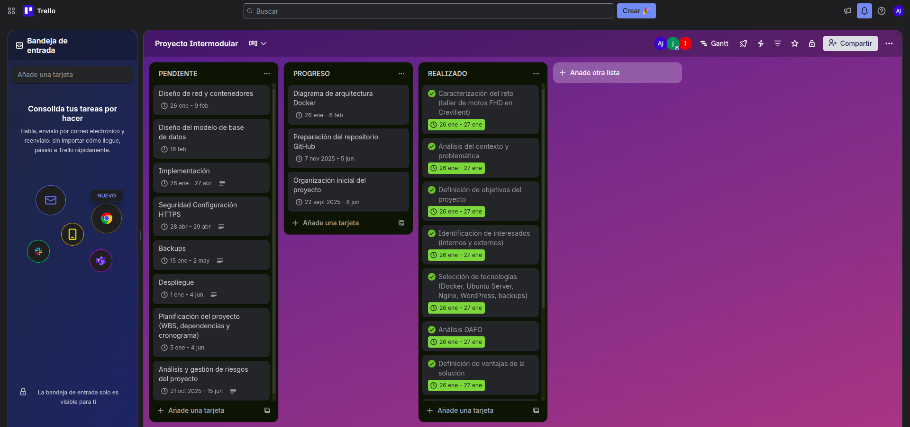
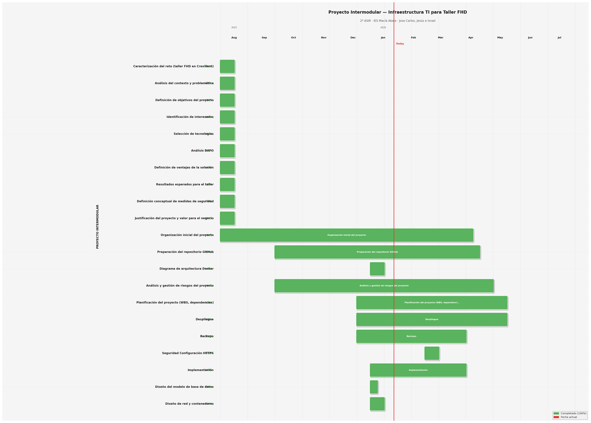

# Planificación

## 1. Planificación del proyecto

La planificación del proyecto se ha organizado en función de un equipo de trabajo compuesto por tres integrantes.  
Cada miembro asume un rol principal, aunque existe colaboración puntual entre roles para garantizar la coherencia y la correcta integración del proyecto.

### 1.1 Organización del equipo y roles

El equipo de trabajo se estructura en los siguientes roles principales:

- **Responsable de infraestructura y sistemas**: responsable de la instalación, administración y mantenimiento tanto del host Ubuntu Server 24.04 como de las redes, contenedores Docker, servidor DNS y sistema de copias de seguridad.
- **Responsable de la base de datos**: responsable de la creación, mantenimiento y gestión de la base de datos, adaptada a las necesidades del taller.
- **Responsable de diseño de aplicaciones y seguridad**: responsable del diseño de la página web y de la seguridad perimetral del servidor mediante Security Groups de AWS.
- **Tutor del proyecto**: supervisión y validación de los entregables.

---

### 1.2 Distribución de roles y responsabilidades

#### Rol 1: Responsable de infraestructura y sistemas

Diseño, implementación y mantenimiento de las tres instancias EC2, Docker, DNS (BIND9), HTTPS, Security Groups y sistema de backups.

**Funciones principales:**

- Despliegue y administración de Ubuntu Server 24.04 en AWS.
- Orquestación de contenedores, redes y volúmenes con Docker Compose v2.
- Configuración de BIND9, certificados SSL y script de backup automatizado.
- Acceso remoto seguro por SSH con claves RSA.

---

#### Rol 2: Responsable de la base de datos

Implantación y gestión de MySQL 8.0: esquema relacional del taller, usuarios con privilegios mínimos e integración con WordPress y Laravel.

**Funciones principales:**

- Diseño del esquema `taller_motos` (5 tablas en español).
- Script de inicialización `01_init.sql` y usuarios `wp_user` / `laravel_user`.
- Validación de persistencia e inclusión en el sistema de backups.

---

#### Rol 3: Responsable de diseño de aplicación y seguridad

Implantación de WordPress y Laravel/Filament sobre la infraestructura, y revisión de la seguridad perimetral en AWS.

**Funciones principales:**

- Despliegue de WordPress (web pública) y Laravel 12 + Filament v3 (panel privado).
- Módulos de gestión del taller en Filament.
- Verificación de accesos y revisión de Security Groups.

---

### 1.3 Planificación por fases

El desarrollo del proyecto se divide en las siguientes fases:

#### Fase 1: Análisis y planificación
- Definición del alcance del proyecto.
- Asignación de roles y responsabilidades.
- Análisis de requisitos funcionales y no funcionales.

#### Fase 2: Diseño técnico
- Diseño de la arquitectura del sistema con tres instancias EC2.
- Diseño de la infraestructura basada en contenedores Docker.
- Diseño del modelo de datos y del diagrama entidad–relación.
- Selección de dominios y planificación del servidor DNS.

#### Fase 3: Implementación
- Despliegue de las tres instancias EC2 en AWS.
- Configuración de Docker, redes y volúmenes en el servidor principal.
- Implantación de WordPress y MySQL.
- Instalación y configuración de Laravel 12 + Filament v3.
- Configuración del servidor DNS con BIND9.
- Implementación del sistema de backups automáticos nocturnos.

#### Fase 4: Seguridad y HTTPS
- Configuración de Security Groups específicos para cada instancia.
- Implementación de HTTPS con certificados Cloudflare Origin.
- Configuración de Nginx para redirección HTTP → HTTPS.
- Configuración del DNS privado para restringir el acceso al panel de Laravel.

#### Fase 5: Pruebas y validación
- Pruebas de funcionamiento de WordPress y Laravel/Filament.
- Validación del acceso a las bases de datos.
- Verificación del servidor DNS desde distintos escenarios de red.
- Comprobación del sistema de backups automáticos.

#### Fase 6: Documentación y entrega
- Redacción final de la documentación.
- Publicación en GitHub Pages.
- Preparación de la entrega final del proyecto.

---

### 1.4 Coordinación y herramientas de seguimiento

El equipo realiza reuniones periódicas para revisar el avance del proyecto, detectar incidencias y coordinar las tareas entre los distintos roles.  
Las decisiones técnicas relevantes se documentan y se consensúan entre los miembros del equipo.

Para el seguimiento de tareas se utiliza **Trello**:

[Enlace directo al tablero de Trello](https://trello.com/invite/b/692dd7425494b38fb1f97d27/ATTI911045e4e016ed353c414db31fc715d86DBA876E/proyecto-intermodular)

Además, como método de registro visual y cronológico, se dispone de un **diagrama de Gantt** que refleja los tiempos dedicados al avance del proyecto:

