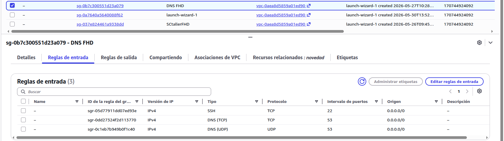
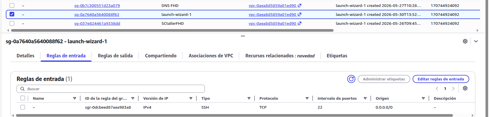

# Desarrollo

En esta fase se ha llevado a cabo el despliegue completo de la infraestructura necesaria para el funcionamiento del sistema de gestión del taller **FHD Proyects**, utilizando servicios de **AWS** y contenedores **Docker** orquestados mediante **Docker Compose v2**.

---

## 1. Infraestructura en AWS

Se desplegaron **tres instancias EC2** en la región `us-east-1` con **Ubuntu Server 24.04 LTS** y **Elastic IP** fija, según el diseño descrito en el capítulo **Marco Tecnológico** (§1.1).

### Security Groups

Los Security Groups se configuraron según las tablas del Marco Tecnológico (§1.2). Evidencia en consola AWS:






El puerto **3306 (MySQL) no está expuesto** en ningún momento.


---

## 2. Estructura del proyecto

Todos los archivos de configuración se organizan bajo `/opt/taller` en el servidor principal:

```
/opt/taller/
├── docker-compose.yml          # Orquestador principal
├── .env                        # Credenciales y variables (nunca en Git)
├── backup.sh                   # Script de backup automático nocturno
├── nginx/
│   ├── conf.d/
│   │   └── default.conf        # Configuración del reverse proxy y HTTPS
│   └── certs/
│       ├── certpub.pem         # Certificado SSL público (Cloudflare)
│       └── certpriv.key        # Clave privada SSL (Cloudflare)
├── mysql/
│   └── init/
│       └── 01_init.sql         # Inicialización de BBD, usuarios y tablas
└── laravel/
    └── Dockerfile              # Imagen personalizada PHP 8.2
```

---

## 3. Docker Compose

El fichero `docker-compose.yml` define los cuatro servicios del sistema, la red interna privada `taller_network` y los tres volúmenes persistentes:

```yaml
services:

  nginx:
    image: nginx:alpine
    ports:
      - "80:80"
      - "443:443"
      - "8081:8081"
    volumes:
      - ./nginx/conf.d:/etc/nginx/conf.d:ro
      - ./nginx/certs:/etc/nginx/certs:ro
      - wordpress_files:/var/www/html:ro
      - laravel_app:/var/www/panel:ro

  wordpress:
    image: wordpress:fpm-alpine
    environment:
      WORDPRESS_DB_HOST: db:3306
      WORDPRESS_DB_NAME: ${WP_DB_NAME}
      WORDPRESS_DB_USER: ${WP_DB_USER}
      WORDPRESS_DB_PASSWORD: ${WP_DB_PASSWORD}
    depends_on:
      db:
        condition: service_healthy

  laravel:
    build:
      context: ./laravel
      dockerfile: Dockerfile
    environment:
      DB_CONNECTION: mysql
      DB_HOST: db
      DB_DATABASE: ${TALLER_DB_NAME}
      DB_USERNAME: ${TALLER_DB_USER}
      DB_PASSWORD: ${TALLER_DB_PASSWORD}
    depends_on:
      db:
        condition: service_healthy

  db:
    image: mysql:8.0
    volumes:
      - mysql_data:/var/lib/mysql
      - ./mysql/init:/docker-entrypoint-initdb.d:ro
    environment:
      MYSQL_ROOT_PASSWORD: ${MYSQL_ROOT_PASSWORD}
      MYSQL_DATABASE: ${WP_DB_NAME}
    healthcheck:
      test: ["CMD", "mysqladmin", "ping", "-h", "localhost"]
      interval: 10s
      retries: 10

volumes:
  mysql_data:
  wordpress_files:
  laravel_app:

networks:
  taller_network:
    driver: bridge
```

Todas las credenciales se cargan desde el fichero `.env`, que nunca se sube al repositorio Git.

---

## 4. Nginx como Reverse Proxy con HTTPS

Nginx actúa como único punto de entrada. Enruta por **dominio** y fuerza HTTPS (redirección 301). Certificados **Cloudflare Origin** en `/opt/taller/nginx/certs/`.

Fragmento relevante de `nginx/conf.d/default.conf`:

```nginx
# Redirección HTTP → HTTPS
server {
    listen 80;
    server_name fhdproyects.innc.link tallerfhd.gestiona;
    return 301 https://$host$request_uri;
}

# Web pública WordPress
server {
    listen 443 ssl;
    server_name fhdproyects.innc.link;
    ssl_certificate     /etc/nginx/certs/certpub.pem;
    ssl_certificate_key /etc/nginx/certs/certpriv.key;
    location / {
        try_files $uri $uri/ /index.php?$args;
        fastcgi_pass wordpress:9000;
        include fastcgi_params;
    }
}

# Panel admin Laravel (solo DNS privado)
server {
    listen 8081 ssl;
    server_name tallerfhd.gestiona;
    ssl_certificate     /etc/nginx/certs/certpub.pem;
    ssl_certificate_key /etc/nginx/certs/certpriv.key;
    root /var/www/panel/public;
    location / {
        try_files $uri $uri/ /index.php?$query_string;
        fastcgi_pass laravel:9000;
        include fastcgi_params;
    }
}
```

> El fichero completo incluye bloques `fastcgi` adicionales para PHP-FPM.

---

## 5. Imagen personalizada de Laravel

Dado que Laravel 12 y Filament v3 requieren extensiones PHP adicionales, se creó una imagen personalizada a partir de `php:8.2-fpm-alpine` que incluye todas las dependencias necesarias, entre ellas `pdo_mysql`, `intl`, `gd` y `zip`, además de **Composer** para la gestión de paquetes.

La extensión `intl` requiere la dependencia del sistema `icu-dev`, que debe instalarse explícitamente antes de compilarla.

---

## 6. Base de datos

MySQL gestiona **dos bases de datos separadas** dentro del mismo contenedor (esquema ER en Marco Tecnológico §1.7):

- `wordpress` — datos del CMS, accedida por el usuario `wp_user`.
- `taller_motos` — datos del negocio, accedida por el usuario `laravel_user`.

La base de datos `taller_motos` contiene **cinco tablas** diseñadas completamente en español:

| Tabla | Descripción |
|-------|-------------|
| `clientes` | Nombre, apellidos, teléfono y email |
| `motos` | Matrícula, marca, modelo y cliente propietario |
| `reparaciones` | Motivo, solución, estado, fechas, km y precio |
| `mecanicos` | Nombre, apellidos, teléfono y estado activo |
| `lista_compra` | Material, cantidad, urgente y comprado |

Las relaciones entre tablas son: un cliente puede tener varias motos, y una moto puede tener varias reparaciones. Cada reparación tiene un mecánico asignado.

---

## 7. Aplicaciones web (WordPress y Laravel/Filament)

Sobre la infraestructura descrita, se implantaron dos aplicaciones:

- **WordPress** — CMS de la web pública en `https://fhdproyects.innc.link`.
- **Laravel 12 + Filament v3** — panel de gestión en `https://tallerfhd.gestiona/admin`, accesible solo con DNS privado. Cinco módulos: clientes, motos, reparaciones, mecánicos y lista de compra.

La personalización del panel (modelos Eloquent, Resources de Filament) es la capa de aplicación sobre el esquema SQL ya definido. Las capturas de funcionamiento se recogen al final del capítulo **Resultados**.

---

## 8. Servidor DNS con BIND9

Se desplegó una segunda instancia EC2 (`18.213.221.53`) con **BIND9** para proporcionar resolución de nombres propia e independiente de Cloudflare.

Se configuro la siguiente zona DNS:

- `tallerfhd.gestiona` → `3.217.215.112` (dominio inventado, solo existe en este DNS)

El portátil del administrador se configuró en `/etc/systemd/resolved.conf` para usar `18.213.221.53` como DNS primario, con `1.1.1.1` como fallback. Esto permite:

- Acceder a `tallerfhd.gestiona` desde el portátil aunque Cloudflare esté bloqueado.
- Demostrar resolución DNS propia en el entorno del centro educativo.
- Mantener la accesibilidad pública del dominio WordPress desde cualquier dispositivo.

---

## 9. Sistema de copias de seguridad automáticas

Tercera instancia EC2 (`54.165.242.48`) dedicada a recibir backups. Conexión **SSH sin contraseña** entre servidores con clave RSA dedicada (`~/.ssh/backup_key`).

### 9.1 Script `backup.sh`

Ubicado en `/opt/taller/backup.sh`:

```bash
#!/bin/bash

# =====================================================
# Script de backup automático — Taller FHD
# Ejecutado cada noche a las 2:00 AM mediante cron
# =====================================================

FECHA=$(date +%Y%m%d_%H%M%S)
SERVIDOR_BACKUP="ubuntu@54.165.242.48"
CLAVE_SSH="/home/ubuntu/.ssh/backup_key"
CARPETA_BACKUP="/opt/backups"
MYSQL_ROOT_PASS="TuPasswordRoot"

echo "[$FECHA] Iniciando backup..."

# 1. Backup base de datos WordPress
echo "Haciendo backup de WordPress DB..."
docker compose -f /opt/taller/docker-compose.yml exec -T db \
    mysqldump -u root -p"$MYSQL_ROOT_PASS" wordpress \
    > /tmp/wordpress_$FECHA.sql

# 2. Backup base de datos taller_motos
echo "Haciendo backup de taller_motos DB..."
docker compose -f /opt/taller/docker-compose.yml exec -T db \
    mysqldump -u root -p"$MYSQL_ROOT_PASS" taller_motos \
    > /tmp/taller_motos_$FECHA.sql

# 3. Backup archivos WordPress
echo "Haciendo backup de archivos WordPress..."
docker run --rm \
    -v wordpress_files:/data \
    -v /tmp:/backup \
    alpine tar czf /backup/wordpress_files_$FECHA.tar.gz -C /data .

# 4. Backup configuración /opt/taller
echo "Haciendo backup de configuración..."
tar czf /tmp/config_$FECHA.tar.gz --exclude=/opt/taller/nginx/certs /opt/taller

# 5. Enviar todo al servidor de backups
echo "Enviando backups al servidor remoto..."
rsync -avz -e "ssh -i $CLAVE_SSH -o StrictHostKeyChecking=no" \
    /tmp/wordpress_$FECHA.sql \
    /tmp/taller_motos_$FECHA.sql \
    /tmp/wordpress_files_$FECHA.tar.gz \
    /tmp/config_$FECHA.tar.gz \
    $SERVIDOR_BACKUP:$CARPETA_BACKUP/

# 6. Limpiar archivos temporales
echo "Limpiando archivos temporales..."
rm -f /tmp/wordpress_$FECHA.sql
rm -f /tmp/taller_motos_$FECHA.sql
rm -f /tmp/wordpress_files_$FECHA.tar.gz
rm -f /tmp/config_$FECHA.tar.gz

echo "[$FECHA] Backup completado!"
```

### 9.2 Automatización con cron

Entrada en el crontab del servidor principal:

```
0 2 * * * /bin/bash /opt/taller/backup.sh >> /var/log/backup.log 2>&1
```

Cada ejecución registra resultado y errores en `/var/log/backup.log`. Los archivos incluyen **fecha y hora** en el nombre.

---

## 10. Verificación del sistema

Tras el despliegue se validó la infraestructura con pruebas de sistema (prioridad ASIR):

| Prueba | Comando / acción | Resultado esperado |
|--------|------------------|-------------------|
| Contenedores activos | `docker compose ps` | 4 servicios Running / Healthy |
| MySQL no expuesto | `nc -zv 3.217.215.112 3306` | Conexión rechazada |
| HTTPS activo | `curl -I https://fhdproyects.innc.link` | Respuesta 200/301 con TLS |
| DNS privado | `dig @18.213.221.53 tallerfhd.gestiona` | Resuelve `3.217.215.112` |
| Backup manual | `sudo bash /opt/taller/backup.sh` | Archivos en `/opt/backups/` del servidor remoto |
| Persistencia | `docker compose restart` + comprobar datos | Datos conservados en volúmenes |

**Accesos de aplicación** (capa superior sobre la infraestructura):

| Servicio | URL |
|----------|-----|
| Web pública WordPress | `https://fhdproyects.innc.link` |
| Panel Laravel/Filament | `https://tallerfhd.gestiona/admin` (solo DNS privado) |