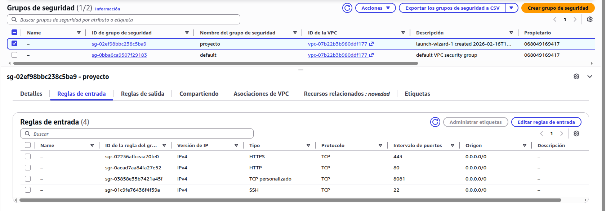

# Desarrollo

En esta fase se ha llevado a cabo el despliegue completo de la infraestructura necesaria para el funcionamiento del sistema de gestión del taller **FHD Proyects**, utilizando servicios de **AWS** y contenedores **Docker** orquestados mediante **Docker Compose v2**.

---

## 1. Infraestructura en AWS

Se ha desplegado una instancia **EC2** en la región `us-east-1` con **Ubuntu Server 22.04 LTS**, asociada a una **Elastic IP** para disponer de dirección pública fija.

### Security Groups

Se configuró un *Security Group* específico con las siguientes reglas de entrada:

| Puerto | Protocolo | Origen    | Uso                                      |
|--------|-----------|-----------|------------------------------------------|
| 22     | TCP       | IP propia | Administración remota por SSH            |
| 80     | TCP       | 0.0.0.0/0 | Web pública WordPress                    |
| 8081   | TCP       | 0.0.0.0/0 | Panel de administración Laravel/Filament |

El puerto **3306 (MySQL) no está expuesto** en ningún momento, garantizando que la base de datos solo sea accesible desde la red interna de Docker.



---

## 2. Estructura del proyecto

Todos los archivos de configuración se organizan bajo `/opt/taller`:

```
/opt/taller/
├── docker-compose.yml          # Orquestador principal
├── .env                        # Credenciales y variables (nunca en Git)
├── nginx/
│   └── conf.d/
│       └── default.conf        # Configuración del reverse proxy
├── mysql/
│   └── init/
│       └── 01_init.sql         # Inicialización de BBD y tablas
└── laravel/
    └── Dockerfile              # Imagen personalizada PHP 8.2
```

Los datos de las aplicaciones se almacenan en **volúmenes Docker gestionados**, fuera del directorio del proyecto, garantizando su persistencia ante reinicios.

---

## 3. Docker Compose

El fichero `docker-compose.yml` define los cuatro servicios del sistema, la red interna privada `taller_network` y los tres volúmenes persistentes:

```yaml
services:

  nginx:
    image: nginx:alpine
    ports:
      - "80:80"
      - "8081:8081"
    volumes:
      - ./nginx/conf.d:/etc/nginx/conf.d:ro
      - wordpress_files:/var/www/html/wordpress:ro
      - laravel_app:/var/www/panel:ro

  wordpress:
    image: wordpress:fpm-alpine
    environment:
      WORDPRESS_DB_HOST: db:3306
      WORDPRESS_DB_NAME: ${WP_DB_NAME}
      WORDPRESS_DB_USER: ${WP_DB_USER}
      WORDPRESS_DB_PASSWORD: ${WP_DB_PASSWORD}
    depends_on:
      db:
        condition: service_healthy

  laravel:
    build:
      context: ./laravel
      dockerfile: Dockerfile
    environment:
      DB_CONNECTION: mysql
      DB_HOST: db
      DB_DATABASE: ${TALLER_DB_NAME}
      DB_USERNAME: ${TALLER_DB_USER}
      DB_PASSWORD: ${TALLER_DB_PASSWORD}
    depends_on:
      db:
        condition: service_healthy

  db:
    image: mysql:8.0
    volumes:
      - mysql_data:/var/lib/mysql
      - ./mysql/init:/docker-entrypoint-initdb.d:ro
    environment:
      MYSQL_ROOT_PASSWORD: ${MYSQL_ROOT_PASSWORD}
      MYSQL_DATABASE: ${WP_DB_NAME}
    healthcheck:
      test: ["CMD", "mysqladmin", "ping", "-h", "localhost"]
      interval: 10s
      retries: 10

volumes:
  mysql_data:
  wordpress_files:
  laravel_app:

networks:
  taller_network:
    driver: bridge
```

Todas las credenciales se cargan desde el fichero `.env`, que nunca se sube al repositorio Git.

---

## 4. Nginx como Reverse Proxy

Nginx actúa como único punto de entrada desde el exterior y enruta el tráfico según el puerto de la petición: el puerto **80** hacia WordPress y el puerto **8081** hacia el panel de administración Laravel/Filament. Ningún otro contenedor tiene puertos expuestos directamente al exterior.

---

## 5. Imagen personalizada de Laravel

Dado que Laravel y Filament requieren extensiones PHP adicionales, se creó una imagen personalizada a partir de `php:8.2-fpm-alpine` que incluye todas las dependencias necesarias, entre ellas `pdo_mysql`, `intl`, `gd` y `zip`, además de **Composer** para la gestión de paquetes.

---

## 6. Base de datos

MySQL gestiona **dos bases de datos separadas** dentro del mismo contenedor:

- `wordpress` — datos del CMS, accedida por el usuario `wp_user`.
- `taller_motos` — datos del negocio (clientes, motos, reparaciones, mecánicos), accedida por el usuario `laravel_user`.

Cada usuario tiene **privilegios mínimos** sobre su propia base de datos únicamente. El script de inicialización crea automáticamente las tablas y carga datos de ejemplo al primer arranque.

---

## 7. Panel de administración Laravel + Filament

Tras el despliegue de los contenedores se instaló **Laravel 11** y **Filament v3** dentro del contenedor, generando los módulos de gestión del taller:

- **Clientes** — registro y búsqueda de clientes.
- **Motos** — vehículos vinculados a cada cliente.
- **Reparaciones** — historial de trabajos con estado, fechas y costes.
- **Mecánicos** — personal del taller.

El panel es accesible en `http://IP:8081/admin` con autenticación propia.

---

## 8. Verificación del sistema

Una vez completado el despliegue se verificó el correcto funcionamiento de todos los servicios:

| URL | Resultado |
|-----|-----------|
| `http://IP/` | Web pública WordPress ✅ |
| `http://IP/wp-admin` | Panel WordPress ✅ |
| `http://IP:8081/admin` | Login Filament ✅ |
| `http://IP:8081/admin/clientes` | Listado de clientes ✅ |
| `http://IP:8081/admin/motos` | Listado de motos ✅ |
| `http://IP:8081/admin/reparaciones` | Listado de reparaciones ✅ |
| `http://IP:8081/admin/mecanicos` | Listado de mecánicos ✅ |

Se comprobó también que los datos persisten tras reiniciar los contenedores y que MySQL **no es accesible desde el exterior** gracias al Security Group y a la red interna de Docker.

---

## 9. Conclusiones de la fase de desarrollo

El uso combinado de **AWS EC2**, **Elastic IP**, **Security Groups** y **Docker Compose** ha permitido desplegar una infraestructura modular, segura y reproducible en la que cada servicio corre de forma aislada y puede ser mantenido o actualizado de forma independiente. El proyecto está preparado para una migración a producción real añadiendo únicamente un dominio propio y certificados SSL con Let's Encrypt.