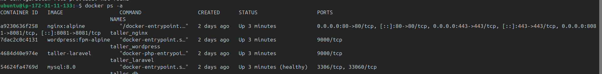
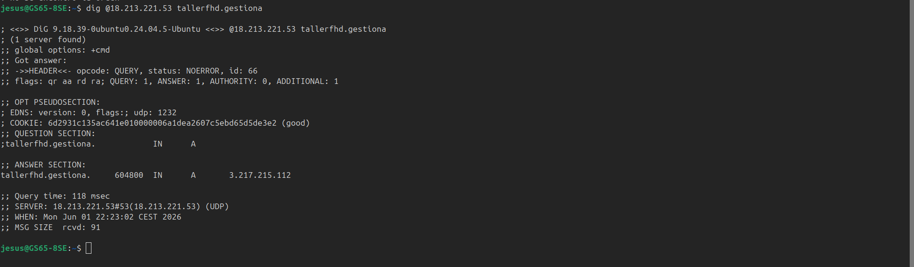
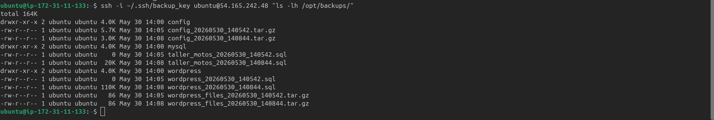
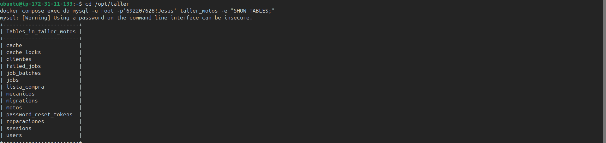
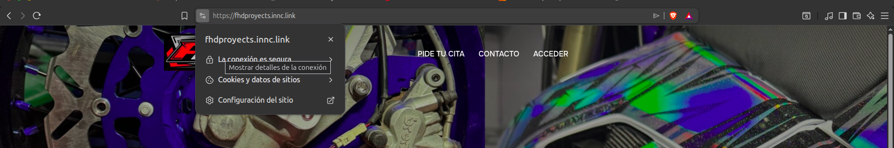
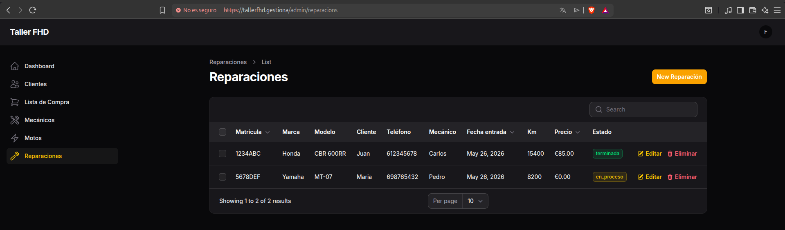

# Resultados

En esta sección se recogen los resultados obtenidos tras el despliegue completo de la infraestructura, verificando el cumplimiento de los objetivos definidos en la fase de planificación.

---

## 1. Resultado general

Se ha desplegado con éxito una infraestructura completa en la nube compuesta por **tres instancias EC2** independientes que dan servicio a una web pública, un panel de administración privado y un sistema de copias de seguridad automáticas. Todos los servicios funcionan con **HTTPS** y dominio propio, y el sistema de resolución DNS privado permite el acceso incluso en entornos con Cloudflare bloqueado.

---

## 2. Comparativa objetivos vs resultados

| Objetivo | Resultado | Estado |
|----------|-----------|--------|
| Desplegar web pública con WordPress | `https://fhdproyects.innc.link` operativo | ✅ |
| Panel de administración privado con Laravel/Filament | `https://tallerfhd.gestiona/admin` operativo | ✅ |
| Comunicaciones seguras con HTTPS | Certificados Cloudflare activos en todos los dominios | ✅ |
| Servidor DNS propio con BIND9 | Resuelve `tallerfhd.gestiona` y `fhdproyects.innc.link` | ✅ |
| Copias de seguridad automáticas nocturnas | Script cron ejecutándose cada noche a las 2:00 AM | ✅ |
| Base de datos del taller en español | 5 tablas relacionales: clientes, motos, reparaciones, mecánicos, lista de compra | ✅ |
| Aislamiento de MySQL | Puerto 3306 no expuesto, solo accesible desde red interna Docker | ✅ |
| Persistencia de datos ante reinicios | Volúmenes Docker funcionando correctamente | ✅ |

---

## 3. Evidencias del despliegue

Las pruebas se organizan por capas de infraestructura (prioridad ASIR). Las aplicaciones web se validan al final.

### 3.1 Servidor principal — contenedores Docker

Cuatro contenedores operativos en red interna `taller_network`:

| Contenedor | Imagen | Estado |
|------------|--------|--------|
| taller_nginx | nginx:alpine | ✅ Running |
| taller_wordpress | wordpress:fpm-alpine | ✅ Running |
| taller_laravel | php:8.2-fpm-alpine (custom) | ✅ Running |
| taller_db | mysql:8.0 | ✅ Healthy |

---

### 3.2 Servidor DNS con BIND9

El DNS privado resuelve correctamente los dominios del taller, incluido `tallerfhd.gestiona` (solo existe en BIND9).

---

### 3.3 Sistema de copias de seguridad

Backups automáticos recibidos cada noche en el servidor independiente.

---

### 3.4 Base de datos

La base `taller_motos` contiene las 5 tablas con relaciones correctamente establecidas.

---

### 3.5 Aplicaciones web

Con la infraestructura validada, las aplicaciones implantadas funcionan correctamente:

**Web pública WordPress** — `https://fhdproyects.innc.link`

**Panel de gestión Laravel/Filament** — `https://tallerfhd.gestiona/admin` (solo DNS privado)

---

## 4. Métricas del sistema

| Métrica | Valor |
|---------|-------|
| Instancias EC2 desplegadas | 3 |
| Contenedores Docker activos | 4 |
| Volúmenes Docker persistentes | 3 |
| Bases de datos | 2 (wordpress + taller_motos) |
| Tablas en taller_motos | 5 |
| Zonas DNS configuradas | 3 |
| Puertos expuestos al exterior | 4 (22, 80, 443, 8081) |
| Backups automáticos | Diarios a las 2:00 AM |
| Protocolo de comunicación web | HTTPS (TLS 1.2/1.3) |

---

## 5. Accesos finales del sistema

| Servicio | URL | Acceso |
|----------|-----|--------|
| Web pública WordPress | `https://fhdproyects.innc.link` | Público |
| Panel WordPress | `https://fhdproyects.innc.link/wp-admin` | Administrador |
| Panel Laravel/Filament | `https://tallerfhd.gestiona/admin` | Solo DNS privado |
| Servidor DNS | `18.213.221.53:53` | Consultas DNS |
| Servidor backups | `54.165.242.48` | Solo SSH interno |